# Volume-Filling Surfaces (and Curves)

<p align="center">
  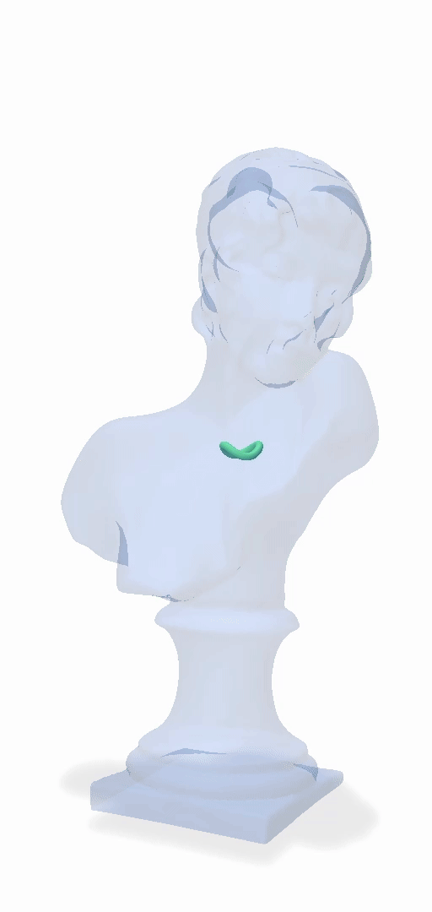
    &nbsp; &nbsp;
  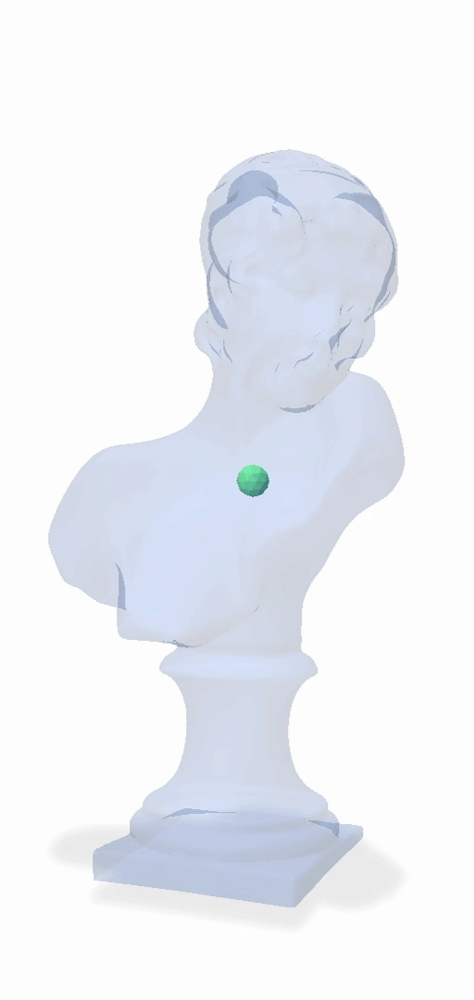 
</p>
<p align="center">
  <em>Fig. 1: Filling a volume with a curve</em>
  &nbsp; &nbsp; &nbsp; &nbsp; &nbsp; &nbsp; &nbsp; &nbsp; &nbsp;
  <em>Fig. 2: Filling a volume with a surface</em>
</p>

We present a novel algorithm to generate closed surfaces that fill a given volume with a given radius. Our algorithm starts with some arbitrary surface and then minimizes an energy that is based on an implicit medial surface representation via standard gradient descent. As an intermediary step, we also developed an approximation for volume-filling curves. Our results, especially for the case of surfaces, prove effective in constructing volume-filling manifolds that look asthetically pleasing. While we do not conduct a thorough comparison to the current state of the art, we have reason to believe that our algorithm can generate comparable results in far less time.

A publication on _Volume-Filling Surfaces_ will follow.<br>
Note that our _Volume-Filling Curves_ are fairly well described in [this recently published paper](https://www.dgp.toronto.edu/projects/medial-sphere-preconditioning/), though their approach seems more polished. (Our project existed before that paper came out.)

## Contents
1. [Project overview and technical background](#project-overview-and-technical-background)
    1. [Introduction](#introduction)
    2. [Technical Background](#technical-background)
    3. [Method](#method)
    4. [Implementation](#implementation)
    5. [Results](#results)
    6. [Discussion and Future Work](#discussion-and-future-work)
2. [Setup](#setup)
3. [Controls](#controls)


## Project overview and technical background
### Introduction
Given some two-dimensional manifold, a <i>surface-filling curve</i> is a curve that lies on the manifold and fills it uniformly.
In other words, every point on the surface has a given maximum distance to the curve, measured geodesically.
Surface-filling curves are primarily used for artistic creation and content generation [1-3],
but also have real-world use cases such as manufacturing [4, 5].<br><br>
Many attempts at an efficient algorithm for generating surface-filling curves have been published (ref. [6, sec. 2]). <i>Repulsive Curves</i> [2]
from Yu et al. was published in 2021 and presents an approach for minimizing a curve's repulsive energy under constraints. While this was originally aimed at solving
different problems in the realm of computational design (global shape optimization while avoiding self-intersections),
the resulting geometric flow could fairly easily be adapted to what they
call <i>curve packing</i>. Curve packing works by growing curves under self-repulsion and constrained to some subspace,
e.g. a surface or a volume, which we label as surface- or volume-filling in this paper respectively.
However, as surface- and volume-filling was merely a bi-product of
Yu et al.'s work, their algorithm was not optimized for that specific task. For the case of surface-filling curves,
Noma et al. therefore developed a much faster solution in 2024 [6],
using an implicit representation of the curve's medial axis to satisfy the surface-filling constraint. However, prior to our paper,
<i>Repulsive Curves</i> remained the state-of-the-art work for volume-filling curves, as Noma et al. have not applied their geometric flow to volumetric domains.<br><br>
Transitioning from curves to surfaces, the currently most important paper for volume-filling surfaces was again published by Yu et al. in 2021
and is called <i> Repulsive Surfaces</i> [7]. Here, Yu et al. once more research global shape optimization without self-intersections,
but this time for surfaces, achieving the then most efficient method for generating volume-filling surfaces as a bi-product.
In contrast to surface-filling curves, to the best of our knowledge, no other paper has been published that specifically tackles
volume-filling surfaces and surpasses the results of [7].<br><br>
In this paper, we do for volume-filling surfaces what Noma et al. did for surface-filling curves: Developing an efficient algorithm
specifically for this use case. We do this by simply applying their idea of using an implicit medial axis, but move from curves to surfaces and from
two-dimensional to three-dimensional manifolds as containing domains, obtaining a fast flow for generating volume-filling surfaces. As intermediate steps,
we first build <i>space-filling</i> curves and then introduce a volumetric boundary-constraint, which results in a faily good approximation
of <i>volume-filling curves</i>. Afterwards, transitioning from curves to surfaces is not difficult.

### Technical Background
What follows are the basic concepts needed to develop our approach for volume-filling curves and surfaces.
We start by defining the Frenet-Serret frame and then transition to medial axes and surfaces.

#### Frenet-Serret frame
<div align="center">
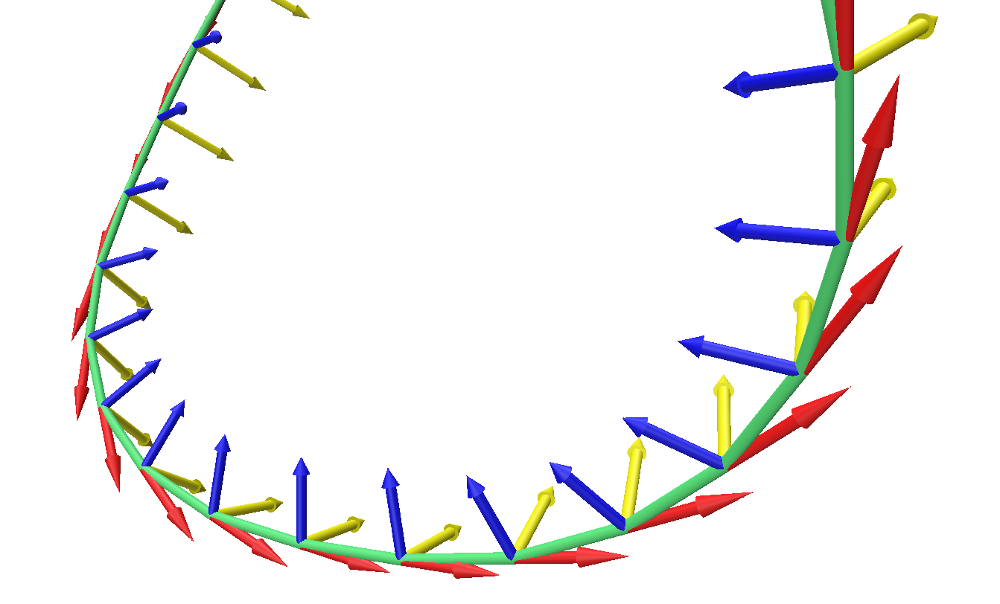
    <p>Fig. 3: Visualization of the Frenet-Serret frame. Tangents are red, normals are blue and bitangents are yellow.</p>
</div>

In order to define the medial axes of curves and surfaces and calculate points on it,
we first introduce a consistent frame on the curve, namely the _Frenet-Serret_ frame (ref. [8]). At any point $\gamma(s)\in\mathbb R^3$
on the curve $\gamma$, the Frenet-Serret frame consists of three mutually orthogonal vectors
that form an orthonormal basis.<br>
The unit <i>tangent vector</i>

$$
    T(s)=\frac{\gamma'(s)}{\lvert\gamma'(s)\rvert}
$$

simply points in the direction of the curve's tangent at $s$. For consistency,
the unit <i>normal vector</i>

$$
    N(s)=\frac{T'(s)}{\lvert T'(s)\rvert}
$$

is defined based on the curve's curvature at that point and always points <i>inward</i>.
Lastly, the unit <i>binormal vector</i> is just

$$
    B(s)=T(s)\times N(s).
$$

#### Medial axes of curves and surfaces
<p align="center">
  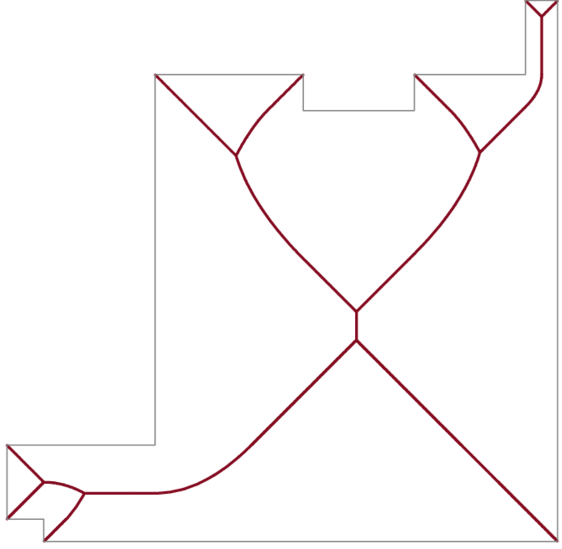
    &nbsp; &nbsp;
  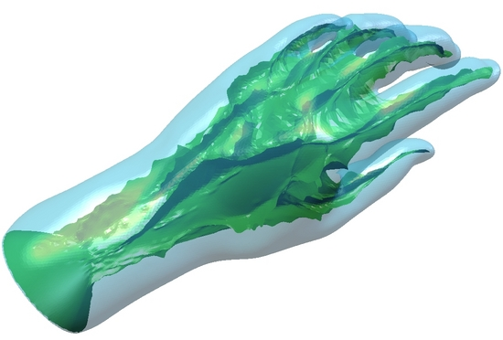 
</p>
<p align="center">
  <em width="35%">Fig. 4: Medial axis of a polygon. Taken from [9, fig. 6], modified.</em>
  &nbsp; &nbsp; &nbsp; &nbsp; &nbsp; &nbsp; 
  <em>Fig. 5: Medial surface of a surface. Original source: [10]</em>
</p>

The <i>medial axis</i> of any bounded region $G$ is the set of all points
that have more than one closest point on the boundary of the region. The medial axis can therefore
be thought as a kind of <i>skeleton</i> of $G$ and describes its rough shape. In this case, usually just
the points inside the region are considered. The points on the medial axis are the centers of maximally
inscribed balls, touching more than one boundary of the bounded region.<br>
The medial axis for a bounded region living in $n$ dimensions is of $n-1$ dimensions. That is, for a bounded region
in 2D, the (interior) medial axis is a one-dimensional graph. For a bounded region in 3D, the medial axis is a two-dimensional
surface and sometimes therefore called <i>medial surface</i> [11, chap. 18]. We will also use this term here.<br>
In this paper, we are not interested in skeletons of shapes and do not restrict ourselves to <i>interior</i> medial axes
or even <i>bounded</i> regions. Instead, we apply the initial definition of the medial axis to both curves and surfaces in 3D.
The theory still holds true; the medial axes for both shape types are surfaces, albeit possibly more than one.
However, the exact topology and number of connected regions is less interesting for us and won't be investigated
in more detail here, as we will only need to calculate distances from the medial surface, for which an implicit representation suffices.

#### Calculating distances from the medial surface
As will become apparent later, we are interested in calculating the distance between a given point on the manifold (i.e., the curve or the surface),
and the medial surface, as well as the direction in which the medial surface-point lies. Note that we specifically concern ourselves with finding
the point on the medial surface to which a given manifold-point is closest to, i.e. the point on the medial surface that was <i>induced</i> by the given manifold-point.
In most cases, this is not the same as simply finding the closest point on the medial surface to a given manifold-point: There might be other points on the medial surface
which are closer to the manifold-point (see fig. 4).
We will use this section to briefly outline the basic approach to finding such distances, and why it is tricky for curves in 3D.<br>
Given a point $\delta(a)\in\mathbb R^3$ on a surface $\delta$ embedded in 3D, it is not difficult to find the point on the medial surface to which $\delta(a)$
(as well as at least one other point) is the closest point on $\delta$. We just need to look into
the directions of $N(a)$ and $-N(a)$, with $N(a)$ being the surface normal at $\delta(a)$, and can use a simple algorithm to find the closest point that serves as the center of a sphere
that touches the surface not just at $\delta(a)$, but also at least one other point. That center then lies on the medial surface and obviously has $\delta(a)$ as one of its
closest points on $\delta$. Implementation details are given in a later section.<br>
Given a point $\gamma(b)\in\mathbb R^3$ on a curve $\gamma$ embedded in 3D, the problem becomes more involved. While the basic approach stays the same, i.e. finding the center
of the smallest sphere touching the curve at $\gamma(b)$ and at least one other point on $\gamma$, we now need to look into <i>all</i> the directions of the plane
spanned by $N(b)$ and $B(b)$. As we only approximate volume-filling curves as an intermediary step to volume-filling surfaces, we will just
introduce a simple approximation in a later section.

### Method
<div align="center">
    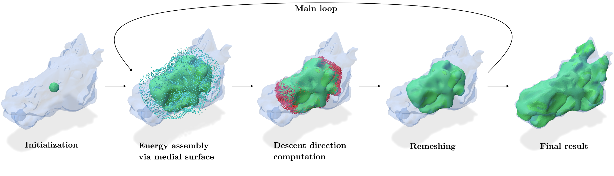
        <p>Fig. 6: Main steps for generating volume-filling surfaces.</p>
</div>

The main steps of our algorithm are depicted in fig. 6. Similar to Noma et al., we apply a geometric flow that minimizes some compound energy,
effectively evolving an initial manifold into a volume-filling one step by step. We begin this section by outlining the
medial surface and length energies for the case of space-filling curves. We then adapt the energy to keep the curve
inside a volume before finalizing with a transition to volume-filling surfaces.<br>
Throughout this section, We use $E_{c,\dots}$ for energies on curves and $E_{s,\dots}$ for energies on surfaces.

#### Medial surface energy
Let us first consider the case of evolving a curve $\gamma$ without a boundary constraint,
trying to find a curve $\gamma^\star$ that fills all of three-dimensional space with some radius $r$.<br>
We start by defining the <i>space-filling condition</i>:
For every point $p\in\mathbb{R}^3$, there must exist a point $q\in\gamma^\star$
such that $\lVert p-q\rVert\leq r$. This condition
is met for all points in 3D if it is met for all points on the medial surface of $\gamma$, which
of course is not possible for an infinite domain.
Therefore, $\gamma$ is space-filling if for every point on the medial surface, the distance to the curve
is less than or equal to $r$. Refer to [6, sec. 3.1] for an analogous definition for the use case of surface-filling curves.<br>
The medial surface energy as defined here is built on that condition: For every $\gamma(s)$ on the curve,
we grow a sphere that touches $\gamma$ at $\gamma(s)$ until it also touches a different point on $\gamma$.
Doing this for all directions on the plane spanned by $N(s)$ and $B(s)$ yields (potentially infinitely many)
spheres, the centers of which are all the points on the medial surface that are induced by $\gamma(s)$.
We sum up the squared distances to these centers along the whole curve to construct our medial surface energy $E_{c,M}$
that we want to minimize.<br>
Note that this approach does not require an implicit representation of the medial surface. Is is easy to see, however,
that when taking infinitely small steps along $\gamma$, the whole medial surface gets approximated. In contrast,
if we were to find the closest point on the medial surface given a point on $\gamma$, the algorithm
of finding that point would be more involved and usually not yield the whole medial surface for infinitely small steps.

#### Volumetric energy
<div align="center">
  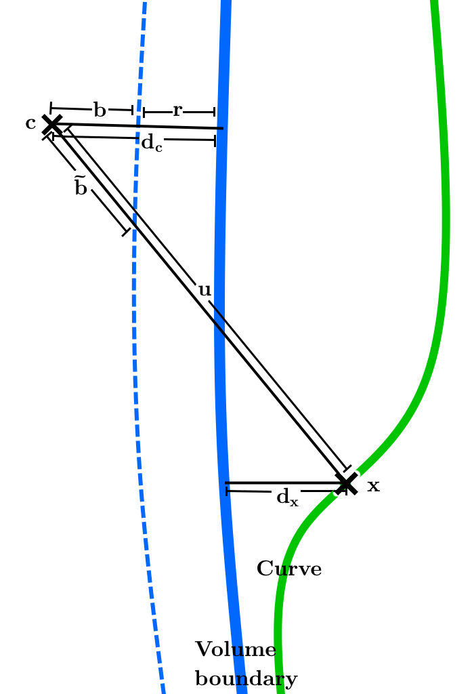
  <p>
  
  Fig. 7: Points and distances to calculate $\tilde b$</p>
</div>

Of course, our goal is not to fill all of three-dimensional space, but rather just a three-dimensional
domain $\Omega\subset\mathbb R^3$ (a <i>volume</i>) that we assume is defined based on some closed surface.<br>
The simplest way for keeping the curve inside the volume is to linearly backproject it onto the surface
if parts of it leave $\Omega$ during a time step. However, we found that this results in the curve getting
<i>stuck</i> on the surface and therefore an unnatural flow, which is why backprojection should only be used
complementarily.<br>
Instead of forcing the curve back into $\Omega$, the curve should <i>feel</i> that it's getting close to the boundary,
and the force pushing it toward the boundary should decrease. The only force pushing the curve outside is our current definition
of the medial surface energy $E_{c,M}$. We can thus achieve a dicreasing force near the boundary by adjusting this energy,
naturally keeping the curve in $\Omega$ as a result.<br>
The medial surface energy can most easily be adjusted by projecting the evaluated sphere-centers onto an imaginary surface that
is exactly $r$ away from the boundary of $\Omega$. Speaking intuitively, this suggests to the curve that there are other parts
of the curve outside of the volume. In effect, this decreases the force to the outside of $\Omega$ steadily, reaching zero
for curve-parts that are right on the border.<br>
For small time steps and volumes that are not too detailed in relation to $r$, we can assume local linearity of the boundary.
This enables fast computation: Given a curve-point $x$, the originally evaluated sphere-center $c$ and
their respective distance-vectors from the surface $d_x, d_c\in\mathbb R^3$, it is elementary to evaluate the
overshot distance

$$
    \tilde b\approx\frac{b\lVert u\rVert\lVert d_x\rVert}{\langle u, d_x\rangle}.
$$

Implied by the local linearity, $b\in\mathbb R$ and $u\in\mathbb R^3$ can be defined as $b=d_c-r$ and $u=\lvert x-c\rvert$, respectively.
Note that the distance to the surface can be evaluated in constant time with the approach described in a later section.<br>
Going forward, we use $E_{c,\tilde M}$ to describe this adapted medial surface energy.

#### Length energy
Just minimizing the medial surface energy would not result in desirable curves, as the flow would try
to minimize the distances to the medial surface as much as possible, resulting in an inifinitely long curve
even in bounded regions. As Noma et al. point out, we are instead just interested in the <i>shortest</i>
curve that satisfies the volume-filling constraint. We therefore add the term $E_{c,L}(\gamma)$ to our energy function
which simply measures the total length of the curve, leading to the overall energy

$$
    E_c(\gamma)=E_{c,L}(\gamma)+\alpha E_{c,\tilde M}(\gamma).
$$

Here, $\alpha\in\mathbb R$ is a coefficient that balances the medial surface energy with the length energy.
It needs to be set based on the desired filling radius $r$.
        
#### From curves to surfaces
Now, the starting point is a surface $\delta$. Once again, the goal is to find
a surface $\delta^\star$ that fills the domain $\Omega$ with some radius $r$.
Starting from $E_{c,L}$ and $E_{c,\tilde M}$ that were designed for curves, deriving
equivalent energies $E_{s,L}$ and $E_{s,\tilde M}$ for the case of surfaces is not difficult.<br>
For the medial surface energy, we keep using the strategy of finding the points on the medial surface
that have a given surface-point $\delta(s)$ as their closest point. However, as described earlier,
instead of having to evaluate infinitely many directions, we now just need to consider
$N(s)$ and $-N(s)$. Evaluating the the sphere-centers can be done as before, and the backprojection
of these centers to an imaginary boundary that is $r$ away from the real boundary is also analogous.<br>
While we previously imposed a penalty on the curves length, we now impose one on the surface's area:
Again, we are interested in the <i>smallest</i> surface that fulfills the volume-filling condition.<br>
As no other energy is needed, the total energy to minimize for volume-filling surfaces is

$$
    E_s(\delta)=E_{s,L}(\delta)+\beta E_{s,\tilde M}(\delta).
$$

Note that the balancing coefficient $\beta\in\mathbb R$ again depends on $r$ and may have a
diffent relation to it than $\alpha$.

### Implementation
This section is used to provide implementation details of our method.
First, the problem of having to evaluate <i>all</i> directions around a curve point is being adressed.
Second, we show how to efficiently compute the distance from any point in space to a volume's boundary,
which is necessary for keeping the curve/surface inside the volume.
The last subsection provides details on how we use an automatic differentation framework to evaluate
the energy's gradient and take steps into that direction.

#### Approximating the medial energy for curves
Recall that for a given curve $\gamma$, for points $\gamma(s)$, all the directions on the plane spanned
by $N(s)$ and $B(s)$ need to considered to get all the points on the medial surface that are induced by $\gamma(s)$.
This problem is difficult to solve correctly and would probably require some integration over all the directions, but as
our focus lies on volume-filling <i>surfaces</i> and not curves, we need to keep the effort low.<br>
As a very simple approximation, we therefore settle on just evaluating $n=2,4,8,16,\dots$ directions on the plane, where
all neighboring directions are spaced by an angle of $\alpha=360°/n$. We found that fair results can already be achieved for $n=2$
when using $B(s)$ and $-B(s)$ as the two directions. However, the flow never stabilizes; the curve keeps moving and adjusting without end.
For $n=4$ (i.e. $B(s),-B(s),N(s),-N(s)$ ), the curve moves less in the final stage, and higher $n$ increase the stability even more.
However, since the evaluating the distsance to the medial surface is the primary bottleneck of the flow,
evaluating more directions significantly impacts performance. As a compromise, we used $n=4$
for all generated graphics in this paper.

#### Computing distances to the medial surface
For using directions to calculate points on the medial surface, we can apply the approach of Noma et al.: 
Given a point $\delta(s)$ on a surface $\delta$ and a direction (e.g. $N(s)$ ), a binary search is applied to find
the center $c$ of a sphere that is tangential to $\delta(s)$ and lays within some tolerance of another
surface-point $\delta(t)$. In essence, if the sphere does not contain any other point (within some tolerace),
it is shifted along the given direction and grown accordingly, and vice versa.<br>
To reduce the computational complexity of finding the next closest point to the current center $c$,
we build a closest-point query data structure upfront, once for each iteration of the gradient descent.
Both Noma et al. and us use a k-d tree for this, specifically the library <i>knn-cpp</i> [12].

#### Computing distances to the volume's boundary
<div align="center">
  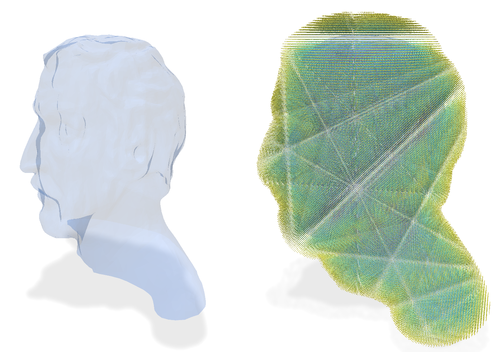
      <p>Fig. 8: Visualization of a signed distance function generated for a volume's boundary.</p>
</div>
For enabling the volume's boundary to exert some force on the curve/surface,
we need to calculate distances from the curve to the boundary. As described earlier, we assume that the volume
is given as a closed surface, specifically a mesh, as that is the usual way of representing boundaries of volumes.<br>
To miminize computational cost during the gradient descent, we can precompute a <i>signed distance function</i> (SDF)
that describes distances to the mesh in the space close to it. Using an SDF, computing the distance
at any point in space is very efficient. The only downside is that adjustments of the mesh should not happen
once the algorithm is running, as this would require recomputing the SDF.<br>
In the past, much research has gone into the efficient construction of an SDF.
Here, we chose OpenVDB [13] as a library to do that, which can evaluate millions of points
within seconds, even for complex meshes on an ordinary computer.

#### Evaluating $\alpha$ and $\beta$
<div align="center">
  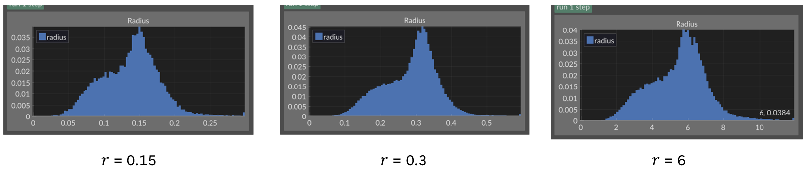
  <p>
  
  Fig. 9: Diagrams visualizing the actual radius distribution across the surface, given a desired radius $r$.</p>
</div>

As previously mentioned, the coefficients $\alpha$ and $\beta$ balance the strength
of the medial surface and length energies. They need to be set in a way such that the
radius of the resulting curve/surface is the desired $r$. Noma et al. mention that they
do not know how to theoretically derive this parameter, and we also have not formalized our
energies enough to be able to give exact formulas for $\alpha$ and $\beta$ in relation to $r$.<br>
For volume-filling curves, we skip providing an approximation for $\alpha$ altogether:
We were only able to provide a simple approximation for the medial surface energy
$E_{c,\tilde M}$, and determining $\alpha$ based on this approximation
would result in even more uncertainty. Moreover, the coefficient would need to be chosen
based on the number of evaluated directions, which heavily influence the radius of the final curve.<br>
For volume-filling surfaces, however, the energy calculation is much simpler and does not need to
rely on approximations. We can therefore proceed to determine a suitable $\beta$. Experimentally,
we find

$$
    r\approx\frac{2.25}{\beta}
$$

to be a good relation. Fig. 9 pictures multiple tests of different scenarios
with $\beta$ being evaluated from this.

### Results
Results of applying our geometric flow to a variety of volumes and filling-radii $r$ are shown below as well
in fig. 1 and fig. 2.

<div align="center">
  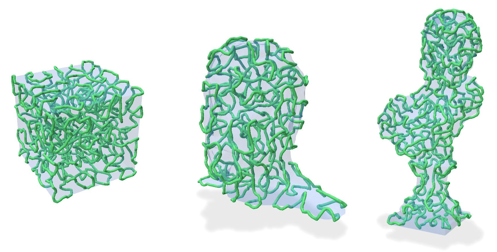
  <p>Fig. 10: Volume-filling curves</p>
</div>

<div align="center">
    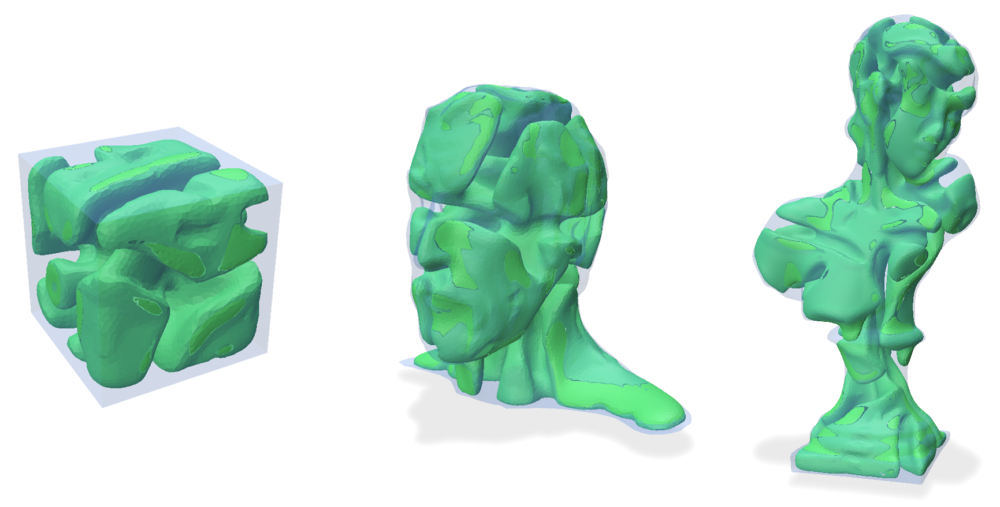
    <p>Fig. 11: Volume-filling surfaces</p>
</div>

As illustrated previously, our algorithm iteratively minimizes an energy
in order to fill a volume with a curve or surface. Generally, the largest changes
are produced in the first iterations until most of the volume is explored; the later steps
descreasingly optimize the energy and result in a radius-diagram that is more focused around
the desired radius.<br>
The coefficients $\alpha$ and $\beta$ allow for some user control and are exposed in our program
through the parameter $r$. We also expose a parameter $r_\text{max}>r$ that specifies a maximum sphere size
for the evaluation of the medial surface energy. When choosing $r_\text{max}$ to be around
two or three times the value of $r$, it effectively stabilizes the flow by preventing
very fast expansion in the first stage of the flow.<br>
Similar to Noma et al., we also expose a parameter $h$ that determines a target size for curve- or
surface segments. After each step, our algorithms loops through all segments and subdivides/merges any
segments that are significantly larger/smaller than $h$.
Other parameters that are exposed are the step size of the flow, whether to grow a curve or a surface,
what curve/surface to start with, what volume to fill, whether to apply a linear backprojection
to the volume's boundary, as well as multiple parameters related to constructing the SDF.<br>
While we did not conduct a detailed analysis of our algorithm's performance against the current
state of the art (namely <i>Repulsive Surfaces</i> by Yu et al.), we can still assume that our
method is significantly faster. Noma et al. provide a comparison of their flow with the one developed
in <i>Repulsive Curves</i>, showing a performance increase of multiple orders of magnitude.
As our approach uses the same principles as Noma et al.'s work, and <i>Repulsive Surfaces</i>
relies on the same energies and minimization techniques as <i>Repulsive Surfaces</i>, we suggest
that our method provides a similar increase in performance for both volume-filling surfaces and curves. To provide intuition
on the performance: Generating the
volume-filling surface in the introductory video is non-linearly sped up; in reality, it took
less than 10 minutes in a standard laptop with some multi-threading applied, resulting in a surface with nearly 70k faces in the end.
The first stage of the flow took about half of that time.

### Discussion and Future Work
While our method works well and produces aesthetically pleasing results,
there are many areas that have not yet been solved correctly and should be
adressed in a future work.<br>
One of the key approximations in this paper is the way in which we compute
$E_{c,\tilde M}$, i.e., the medial surface energy for curves. As described,
a <i>correct</i> solution would evaluate all directions on the plane spanned by
$N(s)$ and $B(s)$ for all points $\gamma(s)$ and not just $n=2,4,8,16,\dots$
directions. For better volume-filling curves, this approximation should be adressed at first.<br>
Secondly, the performance can be optimized through some approximations. For example,
the flow for volume-filling surfaces quickly stabilizes for some parts of the surface
while other parts still explore the volume. The stabile parts, however, are still
considered by the flow in every step, resulting in unnecessary computational cost
that could be avoided.<br>
Furthermore, the exposed parameters have to be chosen carefully and in relation to each other.
For instance, a too high value of $r_\text{max}$ results in an exploding flow and a too small value
will make the algorithm very slow; a similar effect applies for the step size.
The parameters configuring the SDF constructing are also highly sensitive and must be chosen
in a way to keep computational cost low but still provide a sufficiently high resolution
for the given volume. A more mature version of our approach should determine
some of these sensitive parameters automatically.<br>
As we chose an SDF to realize our volume constraint, our algorithm can only accept
watertight meshes that divide space into inside and outside. This is contrasting to
<i>Repulsive Surfaces</i> that can accept any form of mesh. Of course, for <i>volume</i>-filling
surfaces, meshes can be expected to be watertight, but this difference should still be considered in any future comparison.<br>
One other fault of our method that we have not yet sufficiently addressed is <i>jumping</i>:
As can be seen in the examples above, the surface sometimes jumps gaps in detailed sections
of the mesh. While linear backprojection to the volume's boundary would decrease occurance of this, we don't like
enabling it as it influences the flow unnaturally. However, we have employed a simple mitigation
technique during the evaluation of medial axis centers: Instead of querying the SDF
at these points in space, which could result in jumping over a small gap back to the inside
of the volume, we instead determine the value by linearly interpolating the distance value
from the surface point. Still, as surface points are not fully prohibited from leaving the mesh,
this mitigation technique does not suffice and still allows for some jumping.<br>
Lastly, a thorough comparison with <i>Repulsive Surfaces</i> for generating volume-filling surfaces
is missing. We should not only compare the performance as briefly discussed in the prior section, but also the
resulting shapes and use cases based on the principles governing the energy minimization process.

### References
<ul class="popover-list">
  <li class="popover-item" id="pedersen_06">
      [1] Hans Pedersen and Karan Singh. 2006. Organic Labyrinths and Mazes. In <i>Proceedings
      of the 4th International Symposium on Non-Photorealistic Animation and Rendering</i>
      (Annecy, France) (<i>NPAR '06</i>). Association for Computing Machinery, New York, NY,
      USA, 79-86. <a href=https://doi.org/10.1145/1124728.1124742>https://doi.org/10.1145/1124728.1124742</a>
  </li>

  <li class="popover-item" id="yu_21">
      [2] Chris Yu, Henrik Schumacher, and Keenan Crane. 2021. Repulsive Curves. <i>ACM Trans.
      Graph.</i> 40, 2, Article 10 (may 2021), 21 pages. <a href=https://doi.org/10.1145/3439429>https://doi.org/10.1145/3439429</a>
  </li>

  <li class="popover-item" id="henrich_24">
      [3] Lasse Henrich and Falko Kötter: Generating Race Tracks With Repulsive Curves. In
      <i>2024 IEEE Conference on Games</i> (Milan, Italy). <a href=https://doi.org/10.1109/CoG60054.2024.10645670>https://doi.org/10.1109/CoG60054.2024.10645670</a>
  </li>

  <li class="popover-item" id="zhao_18">
      [4] Haisen Zhao, Hao Zhang, Shiqing Xin, Yuanmin Deng, Changhe Tu, Wenping Wang,
      Daniel Cohen-Or, and Baoquan Chen. 2018. DSCarver: Decompose-and-SpiralCarve for Subtractive Manufacturing. <i>ACM Trans. Graph.</i> 37, 4, Article 137 (jul 2018),
      14 pages. <a href=https://doi.org/10.1145/3197517.3201338>https://doi.org/10.1145/3197517.3201338</a>
  </li>
  
  <li class="popover-item" id="chermain_23">
      [5] Xavier Chermain, Cédric Zanni, Jonàs Martínez, Pierre-Alexandre Hugron, and Sylvain Lefebvre. 2023. Orientable Dense Cyclic Infill for Anisotropic Appearance
      Fabrication. <i>ACM Trans. Graph.</i> 42, 4, Article 68 (jul 2023), 13 pages. <a href=https://doi.org/10.1145/3592412>https://doi.org/10.1145/3592412</a>
  </li>

  <li class="popover-item" id="noma_24">
      [6] Yuta Noma, Silvia Sellán, Nicholas Sharp, Karan Singh, and Alec Jacobson. 2024. Surface-Filling Curve Flows via Implicit Medial Axes.
      <i>ACM Trans. Graph.</i> 43, 4, Article 147 (jul 2024), 12 pages. <a href=https://doi.org/10.1145/3658158>https://doi.org/10.1145/3658158</a>
  </li>

  <li class="popover-item" id="yu_21_2">
      [7] Chris Yu, Caleb Brakensiek, Henrik Schumacher, and Keenan Crane. 2021. Repulsive surfaces.
      <i>ACM Trans. Graph.</i> 40, 6, Article 268 (dec 2021), 19 pages. <a href=https://doi.org/10.1145/3478513.3480521>https://doi.org/10.1145/3478513.3480521</a>
  </li>

  <li class="popover-item" id="murray_10">
      [8] Mate, Attila. 2017. The frenet-serret formulas. <i>Brooklyn Collage Of The City University Of New York, izdano</i> 19 (2017).
      <a href="http://www.sci.brooklyn.cuny.edu/~mate/misc/frenet_serret.pdf">http://www.sci.brooklyn.cuny.edu/~mate/misc/frenet_serret.pdf</a>
  </li>

  <li class="popover-item" id="murray_10">
      [9] Murray, Alan. 2010. Advances in Location Modeling: GIS Linkages and Contributions.
      <i>J Geogr Syst</i> 12, 335-354 (2010). <a href="https://doi.org/10.1007/s10109-009-0105-9">https://doi.org/10.1007/s10109-009-0105-9</a>
  </li>

  <li class="popover-item" id="shin_11">
      [10] Yoshizawa, Shin. Manifold Approximation of 3D Medial Axis.
      <a href="https://www2.riken.jp/brict/Yoshizawa/Research/Skeleton.html">https://www2.riken.jp/brict/Yoshizawa/Research/Skeleton.html</a>.
      Accessed 27.08.2025.
  </li>

  <li class="popover-item" id="farin_02">
      [11] G. Farin, J. Hoschek, and M.-S. Kim. 2002. Handbook of Computer Aided Geometric Design (1st. ed.). North Holland &amp; IFIP.
  </li>

  <li class="popover-item" id="knn_cpp">
      [12] Fabian Meyer. 2019. knn-cpp: A header-only C++ library for k nearest neighbor search with Eigen3.
      <a href="https://github.com/Rookfighter/knn-cpp">https://github.com/Rookfighter/knn-cpp</a>
  </li>

  <li class="popover-item" id="openvdb">
      [13] OpenVDB: Sparse volume data structure and tools.
      <a href="https://github.com/AcademySoftwareFoundation/openvdb">https://github.com/AcademySoftwareFoundation/openvdb</a>
  </li>
</ul>

## Setup
The project is a CMake project. It has, however, been developed with Visual Studio 2022, and there are some dependencies to that development environment and the build tools.
1. If you have vcpkg globally installed, proceed with the next step. If not: vcpkg is a library manager that we need to use OpenVDB, the library that generates the SDF for us. If you have not installed vcpkg at all, install it globally on your system. (You can also install it locally for the project, but I'm not sure how to use it then.)
2. Use vcpkg to install OpenVDB. It should work by just running `vcpkg install openvdb`, but you might need to play around with this. Afterwards, when running `vcpkg list` in the terminal, you should see _openvdb_ listed. Now, `find_package(OpenVDB, ...)` in CMakeLists.txt should work.
1. Before opening the project with Visual Studio, open the CMakePresets.json file and replace _PATH_TO_VCPKG_ with the path to your vcpkg installation.
1. Run Visual Studio as an __administrator__.
1. Open the _development_ folder (just as a folder, not a VS project).
1. Make sure that volume-filling-curves.exe is selected in the target dropdown. Also, you may want to switch to release mode.

1. Wait for the CMake generation to finish and then build the project.

You can run the project directly from within Visual Studio, but you have to specify a scene file. One way of doing that is to specify a launch.vs.json file, which you can do by right-clicking the CMakeLists.txt and opening the _Debug and Launch Settings_.


Afterwards, paste the following contents:
```json
{
  "version": "0.2.1",
  "defaults": {},
  "configurations": [
    {
      "type": "default",
      "project": "CMakeLists.txt",
      "projectTarget": "volume-filling-curves.exe",
      "name": "volume-filling-curves.exe",
      "args": [
        "PATH_TO_PROJECT/models/98480/scene_small.txt"
      ]
    }
  ]
}
```
Alternatively (e.g. if you don't see that option in the context-window), you can create a launch.vs.json file in the .vs folder. 

Note that while the entry file is named _volume-filling-curves.cpp_, it does also contain the code for volume-filling _surfaces_.

## Controls
The application is based on polyscope and the UI should be familiar. On the right, you can run the algorithm step by step or for a certain number of iterations. You can also click the space bar to run a single iteration. On the left, multiple visualizations can be controlled.

The scene file that you have to pass can contain a lot of different options. Refer to the many examples in this project (e.g. 72286, 98480, 68380) for guidance, but note that some scenes might not work anymore because of changes in accepted inputs and the algorithm itself. Also refer to _scene_file.cpp_ for more insights.
